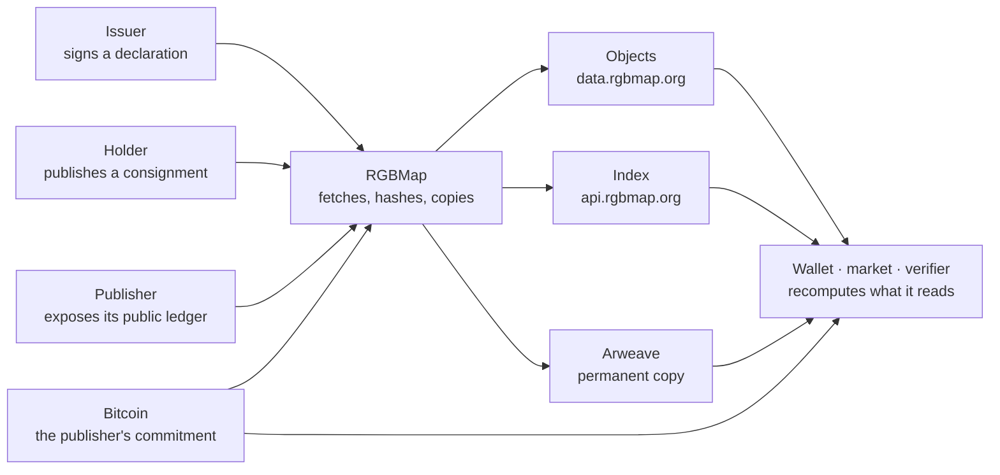

<p align="center">
  
</p>

<p align="center">
  <b>Public identity for RGB assets, and a coverage map of where their supply provably sits.</b>
</p>

<p align="center">
  <a href="https://rgbmap.org">rgbmap.org</a> ·
  <a href="https://rgbmap.org/docs">Documentation</a> ·
  <a href="https://rgbmap.org/docs/what-rgbmap-does-not-state">What RGBMap does not state</a> ·
  <a href="https://rgbmap.org/docs/verification">Verify it yourself</a>
</p>

---

## What it is

An RGB asset lives in the wallets that hold it. Its contract is not on a chain, its history
travels as a file, and nothing about it is discoverable: two contracts may carry the same
ticker, and no amount of chain scanning shows where the supply has gone.

RGBMap publishes what those can be checked against — the identity an issuer signed, and every
transfer output that a published consignment proves. It is a format and a set of rules, not a
chain and not a database. Every object behind every answer is published. Anyone can rebuild
the whole index from it, and anyone can publish under the same format.

## The map is lit by holders

RGB is client-side validation: bitcoin carries only commitments, and a transfer's history
lives in the consignments the parties hold. No crawler produces the picture, so every lit
cell on an asset's map is somebody who published their own consignment. That is the act this
site is built around.

<p align="center">
  
</p>

<p align="center">
  <sub>One asset's consignment map: each cell is 1% of the issued supply, lit by a consignment its holder chose to publish.</sub>
</p>

**[Read a consignment](https://rgbmap.org/mainnet/consignment)** opens one and reports what it
is made of: one step per operation, what it spends, what it creates, and the transaction each
step is anchored to. rgb-lib compiled to WebAssembly runs in the tab — no wallet, no seed, no
account, no upload. The file does not leave the browser. Publishing it afterwards is the
reader's choice, and it is what lights the cells.

<p align="center">
  
</p>

## What it holds

| Layer | Contents | The question it answers |
|---|---|---|
| **Assets** | Contract id, protocol version, schema, name, ticker, precision, issuer signature, media digests | Who and what is this asset |
| **Collections** | A declared size, and which items actually claimed a place in it | Which items belong to one declared set, and who says so |
| **Transfers** | Every transfer output published consignments prove, each naming its proof on Arweave | What moved, and where is the file that proves it |
| **Ledgers** | The public segment of a publisher's ledger, and reserve snapshots | Does what this platform wrote add up, and has it been rewritten |
| **Verification** | A published procedure and an open checker, reading only the archive and bitcoin | Without asking anyone, do you reach the same conclusion |

Registration is a declaration the issuer signs and publishes to Arweave; the index finds it on
the public gateways, verifies the signature, and compares it with what else it holds. A
platform can go further and connect its own ledger, committed to bitcoin once a day — a
commitment fixes the position, the time and the order of everything written before it.

## What it never does

| | |
|---|---|
| **It does not decide** | RGBMap states what it checked. It does not say an asset is safe, official, genuine or worth anything |
| **It does not merge** | Every status stands on its own. There is no combined "verified" mark, and no `isValid` in either SDK |
| **It does not approve** | Nobody reviews a registration, and nothing is gated |
| **It does not delist** | An asset that is reported, disputed or clashing with another stays visible, with the conflict shown |
| **It does not hold funds** | An indexed ledger belongs to a custodial platform. Anchoring proves what was written; it does not make the assets non-custodial |
| **It does not promote** | No integrator is advertised here. A publisher's or an issuer's name appears as the attribution of a specific record, never in a heading, a list or a recommendation |
| **It does not know who is reading** | No account, no session, no wallet address is recorded |

## How the pieces fit



Nothing here is the source of the data. A publisher runs its own ledger and exposes it read
only; RGBMap copies, hashes and serves what that interface already states. There is no
privileged channel: whatever a publisher does not publish is not indexed either.

## Check it yourself

The index is not the source of truth: where an index and a recomputation disagree, the
recomputation wins. The procedure is published, and so is a checker that runs it against the
archive and one bitcoin interface.

```sh
cargo install rgbmap-verify

rgbmap-verify \
  --objects https://data.rgbmap.org \
  --index https://api.rgbmap.org \
  --publisher <network>:<genesis record hash> \
  --bitcoin https://mempool.space/signet/api
```

```text
4 objects named: 1 ledger shards, 2 snapshots
  ✓ 3 objects fetched from https://data.rgbmap.org and hashed
  ✓ 1 shards, continuous through #96
  ✓ 96 records recompute from the genesis record, 2 of them opened in full
  ✓ 2 anchors carry their commitment on bitcoin
```

The same eight checks are in the SDK.

```sh
npm install @rgb-map/sdk          # JavaScript
cargo add rgbmap                  # Rust
```

```js
import { client } from '@rgb-map/sdk'

const rgbmap = client({ network: 'mainnet' })

const asset = await rgbmap.resolve('rgb:…')
asset.status.issuer_signed        // each status separately; there is no verdict
asset.same_ticker.count           // how many other contracts carry this ticker

const page = await rgbmap.ledgerChecked({ limit: 200 })
page.problems                     // empty when everything recomputes here
```

Asking an index about one asset at a time tells it what its user holds. A whole network's asset
list is one call, and comparison happens locally.

## Repositories

| | |
|---|---|
| [**sdk**](https://github.com/rgbmap/sdk) | The protocol primitives, a client that recomputes what it reads, and an offline verifier. JavaScript and Rust, held to the same vectors. MIT |

## Documentation

Grouped by task, at [rgbmap.org/docs](https://rgbmap.org/docs).

| | |
|---|---|
| [Complete the map](https://rgbmap.org/docs/asset-map) | What the colours mean, how to read a consignment privately, and how to publish it |
| [Register an asset](https://rgbmap.org/docs/registering-an-asset) | The manifest, the signature, and the three issuer proofs |
| [Call the API](https://rgbmap.org/docs/query-api) | The read interface, and the evidence every answer carries |
| [Publish a ledger](https://rgbmap.org/docs/ledgers-and-anchors) | What a conforming ledger looks like, what is published, how it is anchored |
| [Check a claim](https://rgbmap.org/docs/verification) | The eight checks, where the bytes come from, and what a passing result does not mean |
| [SDK](https://rgbmap.org/docs/sdk-javascript) | JavaScript and Rust, one set of test vectors |

<sub>contact@rgbmap.org</sub>
